[](https://classroom.github.com/a/VsbltiDW)

## 1. 编译Linux内核 
### 步骤
- 配置内核并选择 *Rust Support*
- 编译内核
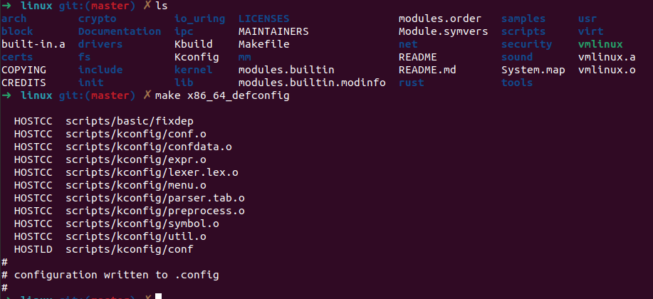
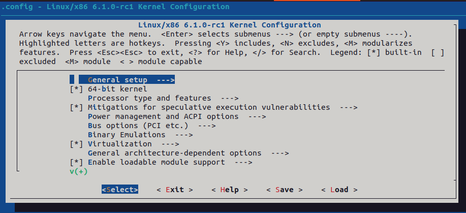
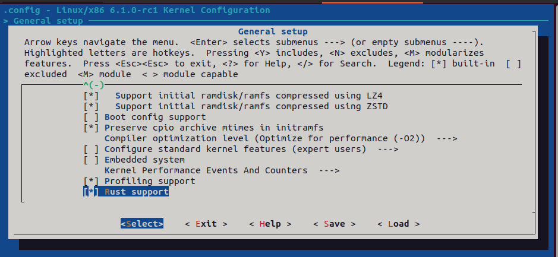
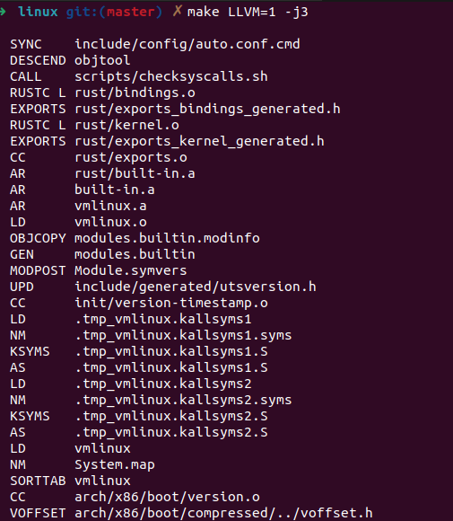
## 2. 对Linux内核进行一些配置
### 步骤
- 配置内核并禁用默认网卡驱动
- 运行 qemu 并检查输出
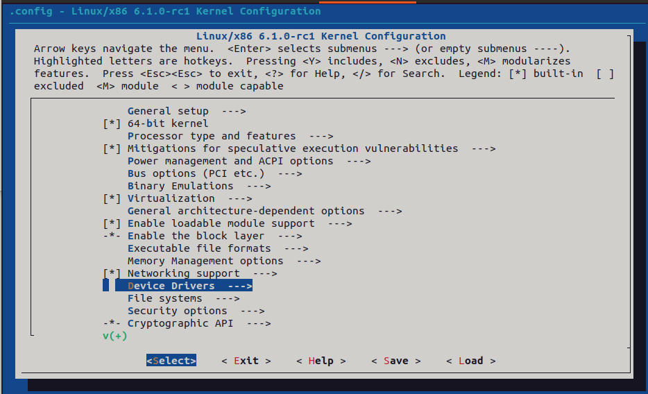
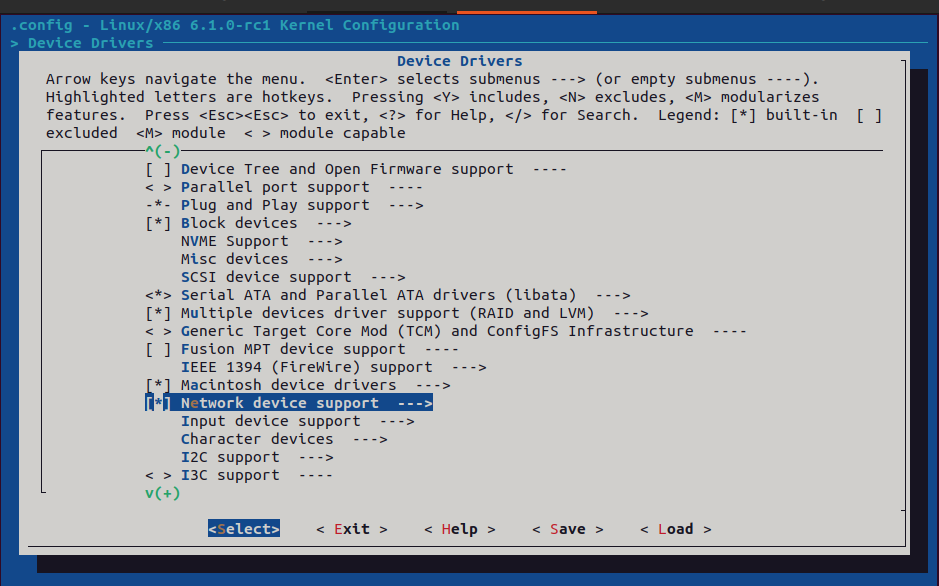
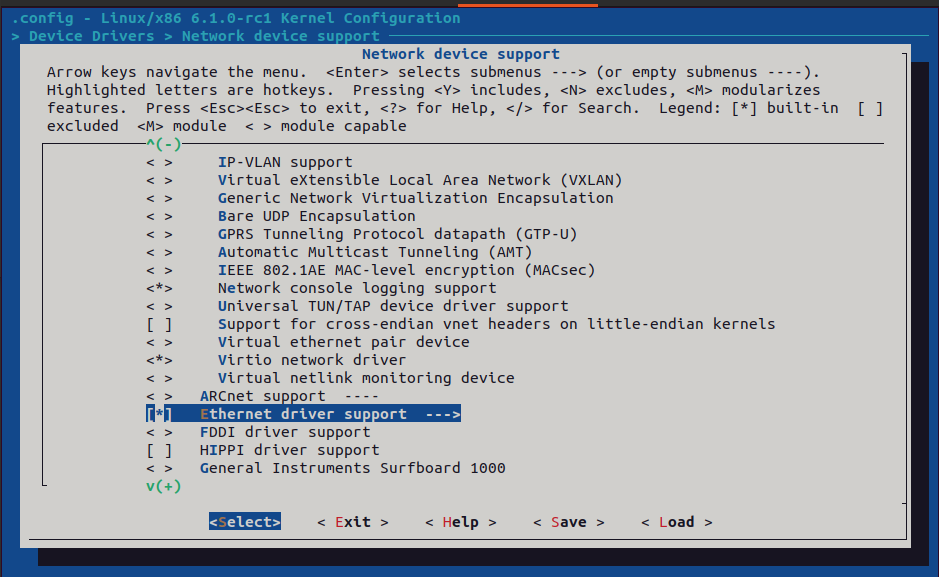
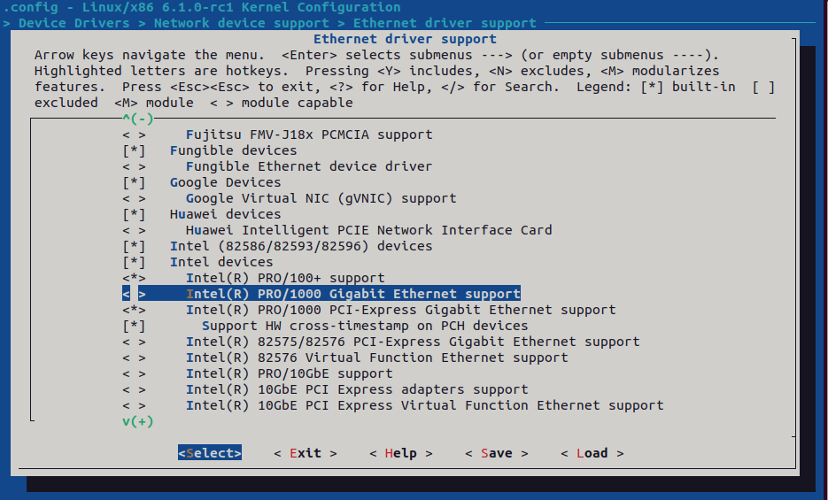
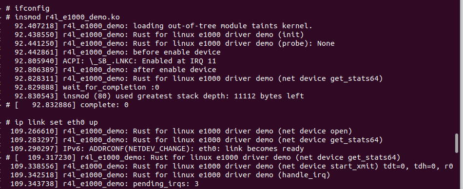
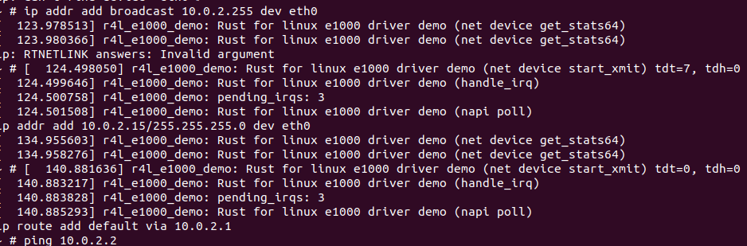
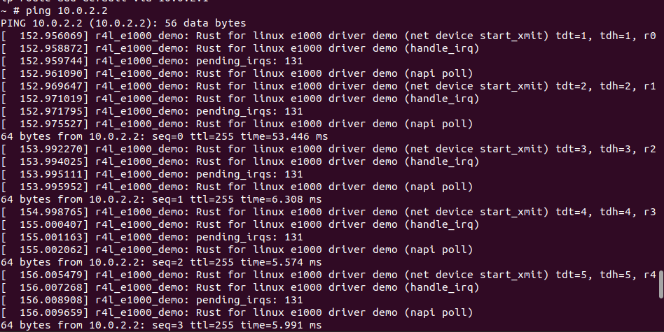
## 3. 使用rust编写一个简单的内核模块并运行
### 步骤
- 修改Kconfig文件及Makefile文件
- 配置相应内核选项
- 运行qemu并检查输出
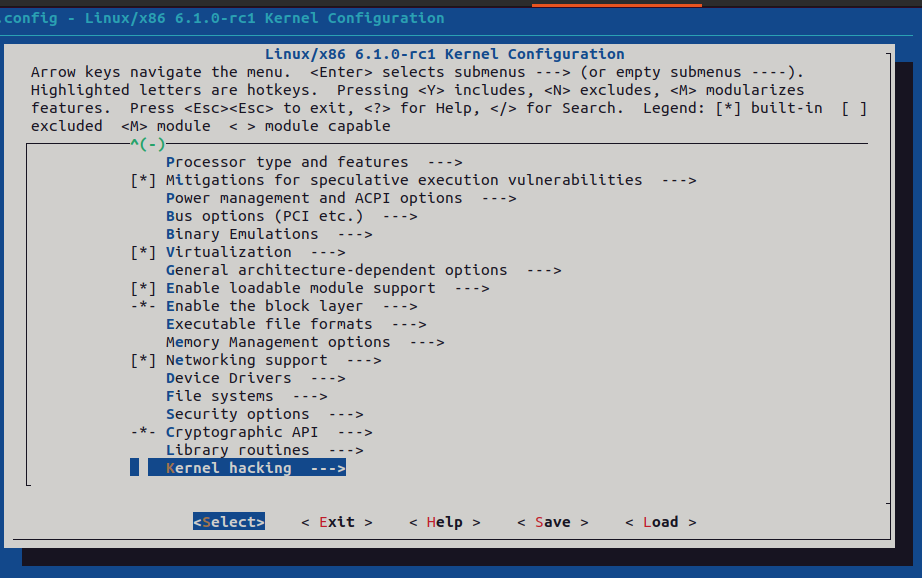
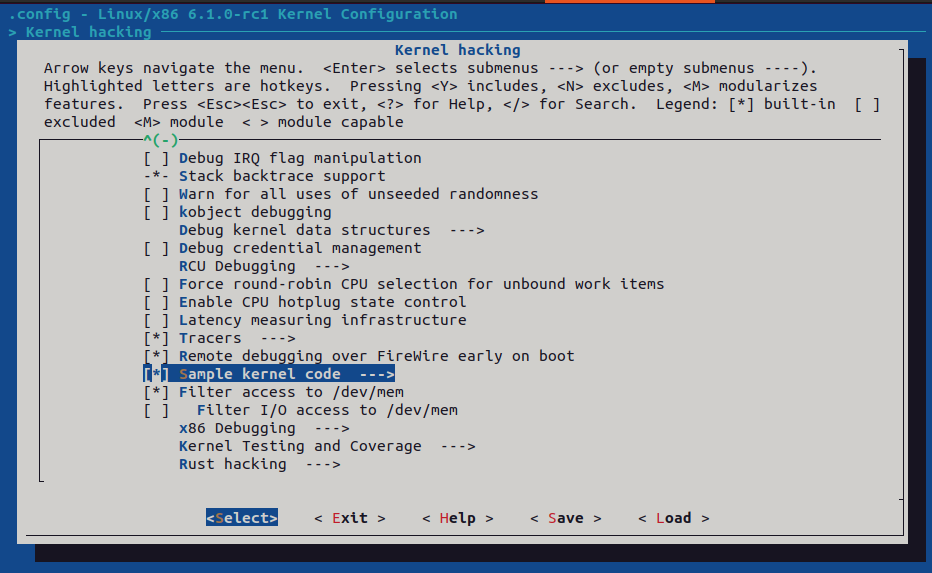
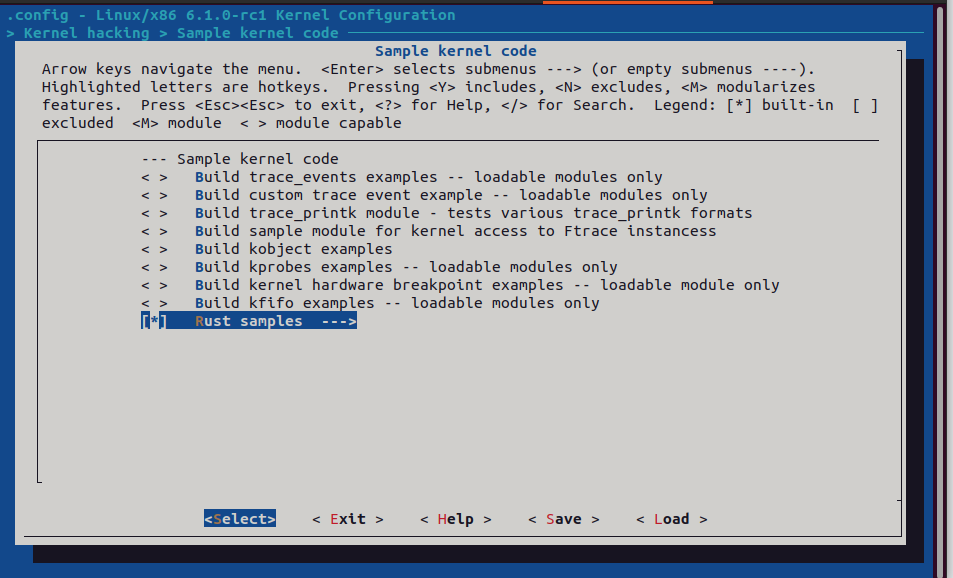
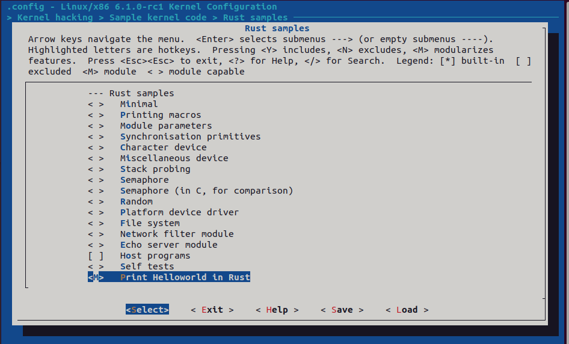
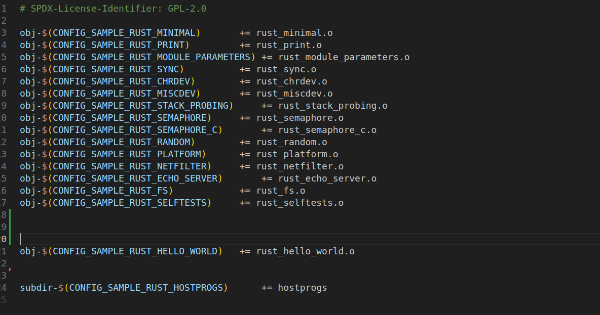
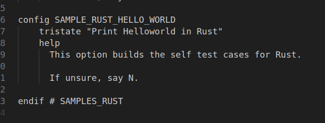
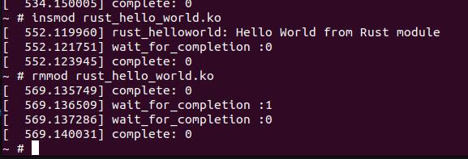

## 4. 为e1000网卡驱动添加remove代码
### 步骤
- 注销 PCI 设备
``` rust
// E1000Drv remove
    unsafe {
            bindings::pci_clear_master(data._pdev.get_ptr());
            // bindings::pci_release_regions(data._pdev.get_ptr());
            bindings::pci_release_selected_regions(data._pdev.get_ptr(),data.bars);
            bindings::pci_disable_device(data._pdev.get_ptr());

    }
```
- 硬件复位
```rust 
// E1000Drv remove()

    data._e1000_hw_ops.e1000_reset_hw();
```
- 禁用 NAPI 设备
```rust
    // NetDevice stop()
     _data.napi.disable();

```
- 释放 irq 资源
```rust
    // NetDevice stop()
    //  释放 irq_handler 资源
    let irq_handler_ptr = _data._irq_handler.swap(core::ptr::null_mut(), core::sync::atomic::Ordering::Relaxed);
    if !irq_handler_ptr.is_null() {
    //     // 将裸指针转换为 Box，随后会自动释放资源
        let _irq_handler_box = unsafe { Box::from_raw(irq_handler_ptr) };
        drop(_irq_handler_box);
    } 
```
- 启动 qemu 并检查输出
``` txt
ip addr add 10.0.2.15/255.255.255.0 dev eth0
[  301.390046] r4l_e1000_demo: Rust for linux e1000 driver demo (net device get_stats64)
[  301.391919] r4l_e1000_demo: Rust for linux e1000 driver demo (net device get_stats64)
~ # ip route add default via 10.0.2.1
~ # ping 10.0.2.2
PING 10.0.2.2 (10.0.2.2): 56 data bytes
[  322.626373] r4l_e1000_demo: Rust for linux e1000 driver demo (net device start_xmit) tdt=3, tdh=3, r0
[  322.629058] r4l_e1000_demo: Rust for linux e1000 driver demo (handle_irq)
[  322.629931] r4l_e1000_demo: pending_irqs: 131
[  322.630642] r4l_e1000_demo: Rust for linux e1000 driver demo (napi poll)
[  322.632940] r4l_e1000_demo: Rust for linux e1000 driver demo (net device start_xmit) tdt=4, tdh=4, r1
[  322.635222] r4l_e1000_demo: Rust for linux e1000 driver demo (handle_irq)
[  322.636163] r4l_e1000_demo: pending_irqs: 131
[  322.637204] r4l_e1000_demo: Rust for linux e1000 driver demo (napi poll)
64 bytes from 10.0.2.2: seq=0 ttl=255 time=13.997 ms
[  323.640297] r4l_e1000_demo: Rust for linux e1000 driver demo (net device start_xmit) tdt=5, tdh=5, r2
[  323.642044] r4l_e1000_demo: Rust for linux e1000 driver demo (handle_irq)
[  323.642971] r4l_e1000_demo: pending_irqs: 131
[  323.643888] r4l_e1000_demo: Rust for linux e1000 driver demo (napi poll)
64 bytes from 10.0.2.2: seq=1 ttl=255 time=5.445 ms
[  324.646791] r4l_e1000_demo: Rust for linux e1000 driver demo (net device start_xmit) tdt=6, tdh=6, r3
[  324.648784] r4l_e1000_demo: Rust for linux e1000 driver demo (handle_irq)
[  324.649846] r4l_e1000_demo: pending_irqs: 131
[  324.650883] r4l_e1000_demo: Rust for linux e1000 driver demo (napi poll)
64 bytes from 10.0.2.2: seq=2 ttl=255 time=6.445 ms
[  325.653497] r4l_e1000_demo: Rust for linux e1000 driver demo (net device start_xmit) tdt=7, tdh=7, r4
[  325.655229] r4l_e1000_demo: Rust for linux e1000 driver demo (handle_irq)
[  325.656263] r4l_e1000_demo: pending_irqs: 131
[  325.657015] r4l_e1000_demo: Rust for linux e1000 driver demo (napi poll)
64 bytes from 10.0.2.2: seq=3 ttl=255 time=5.492 ms
^C
--- 10.0.2.2 ping statistics ---
4 packets transmitted, 4 packets received, 0% packet loss
round-trip min/avg/max = 5.445/7.844/13.997 ms
~ # rmmod r4l_e1000_demo.ko [  332.883519] complete: 0
[  332.885076] complete: 0
[  332.885961] complete: 0
[  332.887003] complete: 0
~ # rmmod r4l_e1000_demo.ko 
[  340.274316] r4l_e1000_demo: Rust for linux e1000 driver demo (exit)
[  340.845251] r4l_e1000_demo: Rust for linux e1000 driver demo (remove)
[  340.846447] r4l_e1000_demo: Rust for linux e1000 driver demo (device_remove)
[  340.848352] r4l_e1000_demo: Rust for linux e1000 driver demo (net device stop)
[  340.849617] r4l_e1000_demo: name 0000:00:03.0
[  340.850094] rust_kernel: irq: free 
[  340.851110] r4l_e1000_demo: Rust for linux e1000 driver demo (net device get_stats64)
[  340.856285] r4l_e1000_demo: Rust for linux e1000 driver demo (net device get_stats64)
[  340.859861] wait_for_completion :0
[  340.861707] complete: 0
[  340.862192] wait_for_completion :0
[  340.864665] complete: 0
[  340.866772] complete: 0
[  340.867064] wait_for_completion :1
[  340.867521] wait_for_completion :0
[  340.869751] complete: 0
~ # insmod r4l_e1000_demo.ko
[  349.085886] r4l_e1000_demo: Rust for linux e1000 driver demo (init)
[  349.088046] r4l_e1000_demo: Rust for linux e1000 driver demo (probe): None
[  349.089241] r4l_e1000_demo: before enable device
[  349.477194] r4l_e1000_demo: after enable device
[  349.498710] r4l_e1000_demo: Rust for linux e1000 driver demo (net device get_stats64)
[  349.499829] wait_for_completion :0
~ # [  349.502836] complete: 0
~ # ip link set eth0 up
[  362.055469] r4l_e1000_demo: Rust for linux e1000 driver demo (net device open)
[  362.066513] r4l_e1000_demo: Rust for linux e1000 driver demo (net device get_stats64)
[  362.069090] IPv6: ADDRCONF(NETDEV_CHANGE): eth0: link becomes ready
[  362.070752] r4l_e1000_demo: Rust for linux e1000 driver demo (net device get_stats64)
[  362.077117] r4l_e1000_demo: Rust for linux e1000 driver demo (net device start_xmit) tdt=0, tdh=0, r0
[  362.079862] r4l_e1000_demo: Rust for linux e1000 driver demo (handle_irq)
[  362.081442] r4l_e1000_demo: pending_irqs: 3
[  362.082613] r4l_e1000_demo: Rust for linux e1000 driver demo (napi poll)
~ # [  362.641476] r4l_e1000_demo: Rust for linux e1000 driver demo (net device start_xmit) tdt=1, tdh=0
[  362.643418] r4l_e1000_demo: Rust for linux e1000 driver demo (handle_irq)
[  362.644755] r4l_e1000_demo: pending_irqs: 3
[  362.645446] r4l_e1000_demo: Rust for linux e1000 driver demo (napi poll)
[  362.833707] r4l_e1000_demo: Rust for linux e1000 driver demo (net device start_xmit) tdt=2, tdh=2, r0
[  362.835400] r4l_e1000_demo: Rust for linux e1000 driver demo (handle_irq)
[  362.836530] r4l_e1000_demo: pending_irqs: 3
[  362.837176] r4l_e1000_demo: Rust for linux e1000 driver demo (napi poll)
[  363.665448] r4l_e1000_demo: Rust for linux e1000 driver demo (net device start_xmit) tdt=3, tdh=3, r0
[  363.667394] r4l_e1000_demo: Rust for linux e1000 driver demo (handle_irq)
[  363.668050] r4l_e1000_demo: pending_irqs: 3
[  363.669207] r4l_e1000_demo: Rust for linux e1000 driver demo (napi poll)
[  363.670816] r4l_e1000_demo: Rust for linux e1000 driver demo (net device start_xmit) tdt=4, tdh=4, r0
[  363.672437] r4l_e1000_demo: Rust for linux e1000 driver demo (handle_irq)
[  363.673405] r4l_e1000_demo: pending_irqs: 3
[  363.674360] r4l_e1000_demo: Rust for linux e1000 driver demo (napi poll)
[  364.688930] r4l_e1000_demo: Rust for linux e1000 driver demo (net device start_xmit) tdt=5, tdh=5, r0
[  364.689574] r4l_e1000_demo: Rust for linux e1000 driver demo (handle_irq)
[  364.689859] r4l_e1000_demo: pending_irqs: 3
[  364.690191] r4l_e1000_demo: Rust for linux e1000 driver demo (napi poll)
[  367.632713] r4l_e1000_demo: Rust for linux e1000 driver demo (net device start_xmit) tdt=6, tdh=6, r0
[  367.633636] r4l_e1000_demo: Rust for linux e1000 driver demo (handle_irq)
[  367.633961] r4l_e1000_demo: pending_irqs: 3
[  367.634124] r4l_e1000_demo: Rust for linux e1000 driver demo (napi poll)
ip addr add broadcast 10.0.2.255 dev eth0?
[  373.399900] r4l_e1000_demo: Rust for linux e1000 driver demo (net device get_stats64)
[  373.401835] r4l_e1000_demo: Rust for linux e1000 driver demo (net device get_stats64)
[  373.416443] complete: 0
[  373.419235] complete: 0
[  373.433162] complete: 0
ip: can't find device 'eth0␅'
~ # ip addr add broadcast 10.0.2.255 dev eth0?[  375.377609] r4l_e1000_demo: Rust for linux e1000 drive0
[  375.379249] r4l_e1000_demo: Rust for linux e1000 driver demo (handle_irq)
[  375.380129] r4l_e1000_demo: pending_irqs: 3
[  375.380919] r4l_e1000_demo: Rust for linux e1000 driver demo (napi poll)
~ # ip addr add broadcast 10.0.2.255 dev eth0
[  382.576888] r4l_e1000_demo: Rust for linux e1000 driver demo (net device get_stats64)
[  382.578941] r4l_e1000_demo: Rust for linux e1000 driver demo (net device get_stats64)
ip: RTNETLINK answers: Invalid argument
~ # [  391.249236] r4l_e1000_demo: Rust for linux e1000 driver demo (net device start_xmit) tdt=0, tdh=0
[  391.250889] r4l_e1000_demo: Rust for linux e1000 driver demo (handle_irq)
[  391.252146] r4l_e1000_demo: pending_irqs: 3
[  391.253121] r4l_e1000_demo: Rust for linux e1000 driver demo (napi poll)
ip addr add 10.0.2.15/255.255.255.0 dev eth0 
[  391.304311] r4l_e1000_demo: Rust for linux e1000 driver demo (net device get_stats64)
[  391.306342] r4l_e1000_demo: Rust for linux e1000 driver demo (net device get_stats64)
~ # ip route add default via 10.0.2.1
~ # ping 10.0.2.2
PING 10.0.2.2 (10.0.2.2): 56 data bytes
[  410.291173] r4l_e1000_demo: Rust for linux e1000 driver demo (net device start_xmit) tdt=1, tdh=1, r0
[  410.293180] r4l_e1000_demo: Rust for linux e1000 driver demo (handle_irq)
[  410.294256] r4l_e1000_demo: pending_irqs: 131
[  410.294972] r4l_e1000_demo: Rust for linux e1000 driver demo (napi poll)
[  410.297193] r4l_e1000_demo: Rust for linux e1000 driver demo (net device start_xmit) tdt=2, tdh=2, r1
[  410.298975] r4l_e1000_demo: Rust for linux e1000 driver demo (handle_irq)
[  410.299834] r4l_e1000_demo: pending_irqs: 131
[  410.300959] r4l_e1000_demo: Rust for linux e1000 driver demo (napi poll)
64 bytes from 10.0.2.2: seq=0 ttl=255 time=12.854 ms
[  411.304174] r4l_e1000_demo: Rust for linux e1000 driver demo (net device start_xmit) tdt=3, tdh=3, r2
[  411.305853] r4l_e1000_demo: Rust for linux e1000 driver demo (handle_irq)
[  411.306503] r4l_e1000_demo: pending_irqs: 131
[  411.307020] r4l_e1000_demo: Rust for linux e1000 driver demo (napi poll)
64 bytes from 10.0.2.2: seq=1 ttl=255 time=5.642 ms
[  412.310767] r4l_e1000_demo: Rust for linux e1000 driver demo (net device start_xmit) tdt=4, tdh=4, r3
[  412.312578] r4l_e1000_demo: Rust for linux e1000 driver demo (handle_irq)
[  412.313470] r4l_e1000_demo: pending_irqs: 131
[  412.314273] r4l_e1000_demo: Rust for linux e1000 driver demo (napi poll)
64 bytes from 10.0.2.2: seq=2 ttl=255 time=5.708 ms

```

## 5. 注册字符设备
### 步骤
- 实现read和write方法
```rust
    rust_chrdev.rs
    write()
    if _reader.is_empty() {
            Ok(0)
    }else if _offset as usize > GLOBALMEM_SIZE {
        // Err(EPERM)
        Ok(0)

    } else{
        let reader_len = _reader.len();
        let mut buf = _this.inner.lock();
         _reader.read_slice(&mut buf[..reader_len])?;
        Ok(reader_len)
    }
```
```rust
    read()
    if _offset as usize >= GLOBALMEM_SIZE {
        // Err(EPERM)
        Ok(0)
    }else {
        let buf = _this.inner.lock();
        // pr_info!("RustFile::read: _offset={}",_offset);
        // pr_info!("RustFile::read: _writer.len()={}",_writer.len());
        // pr_info!("RustFile::read: buf.len()={}",buf.len());
        _writer.write_slice(&buf[_offset as usize..])?;
        Ok(buf.len())
    }
```
- 启动 qemu 并检查输出
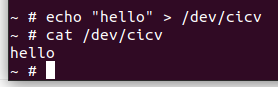

## 6. 项目小实验
### 思路
- 使用全局变量保存 completion 结构体
- 针对全局变量必须初始化的问题，采用枚举结构体来进行初始化
- 模块初始化时，对于 comletion 结构体进行初始化并赋值给全局变量
- 在read和write方法中调用 completion 结构体的   wait_for_completion 及 complete 方法
```rust
/// init 
pub fn init_completion_data() {
  pr_info!("init_completion_data");

  unsafe {
    COMPLETION_DATA =  CompletionData::Data(bindings::completion::default());
    match COMPLETION_DATA {
      CompletionData::IsEmpty(_) => {},
      CompletionData::Data(ref mut data) => {
      bindings::init_completion(data as * mut _);
      // bindings::complete(data as * mut _);
      }
    }
  }
}
    /// write() 关键代码
    pr_info!("write");  
    pr_info!("pid:{}", Task::current().pid());
    unsafe {
        match COMPLETION_DATA {
            CompletionData::IsEmpty(_) => {},
            CompletionData::Data(ref mut data) => {
          bindings::complete(data as * mut _);
            }
        }
    }

    /// read() 关键代码
    pr_info!("read\n");    
    pr_info!("pid:{}", Task::current().pid());
	pr_info!("process {} is going to sleep\n", Task::current().pid());
    unsafe {
        match COMPLETION_DATA {
            CompletionData::IsEmpty(_) => {},
            CompletionData::Data(ref mut data) => {
            pr_info!("should wait for completion");
            bindings::wait_for_completion(data as * mut _);
          }
        }
      }
```
### 实验结果
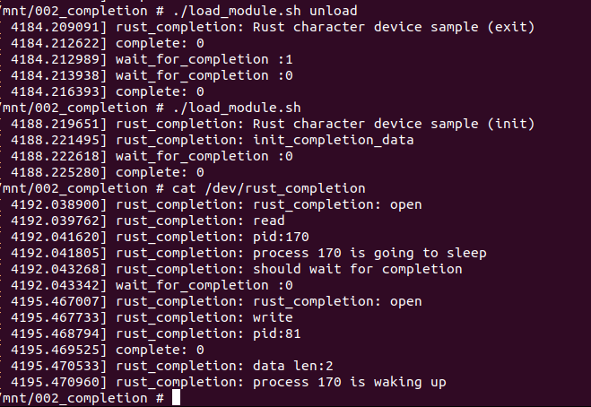
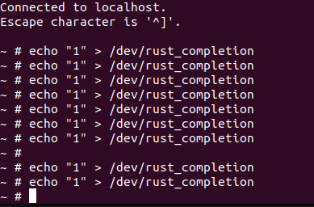

## 问答题
- 编译成内核模块，是在哪个文件中以哪条语句定义的？
    - 文件夹下的 Kbuild 文件，
    ```Kbuild
        obj-m := r4l_e1000_demo.o
    ```
- 该模块位于独立的文件夹内，却能编译成Linux内核模块，这叫做out-of-tree module，请分析它是如何与内核代码产生联系的？
    - 内核提供了接口及API，可以通过这些接口来开发模块
    - 通过Kbuild系统进行模块编译
    - 内核编译过程中生成符号表等信息，可以用于模块编译

- 作业5中的字符设备/dev/cicv是怎么创建的？它的设备号是多少？它是如何与我们写的字符设备驱动关联上的？
    - 在build_image.sh脚本中, 添加如下语句创建字符串设备 主设备号 248, 次设备号 0
    ```shell
    echo "mknod /dev/cicv c 248 0" >> etc/init.d/rcS
    ```
    - 驱动与字符设备通过设备号关联，驱动运行时注册主设备号及次设备号，字符设备运行时通过主设备号进行匹配
    （上述代码中直接写死主设备号是因为qemu启动流程固定，自动分配到该设备号且保持不变）

